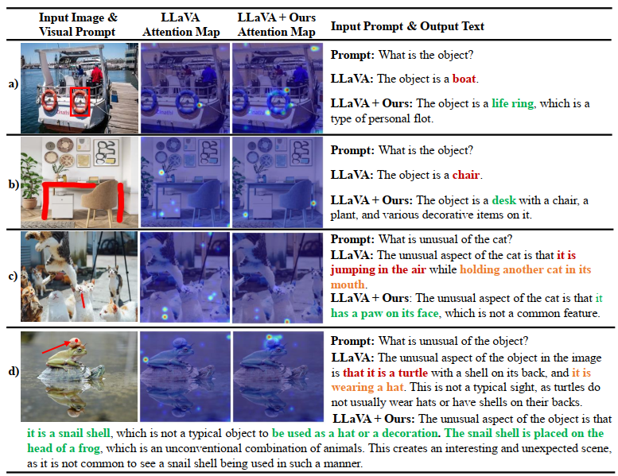

# ControlMLLM


The repo is for the paper [ControlMLLM: Training-Free Visual Prompt Learning for Multimodal Large Language Models](https://arxiv.org/abs/2407.21534).

```
@misc{wu2024controlmllmtrainingfreevisualprompt,
      title={ControlMLLM: Training-Free Visual Prompt Learning for Multimodal Large Language Models}, 
      author={Mingrui Wu and Xinyue Cai and Jiayi Ji and Jiale Li and Oucheng Huang and Gen Luo and Hao Fei and Xiaoshuai Sun and Rongrong Ji},
      year={2024},
      eprint={2407.21534},
      archivePrefix={arXiv},
      primaryClass={cs.CV},
      url={https://arxiv.org/abs/2407.21534}, 
}
```

We will upload the code in a few days once it's ready.
