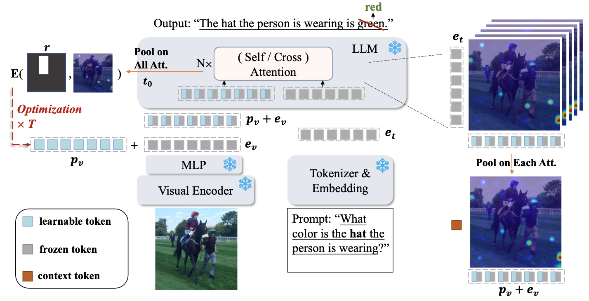
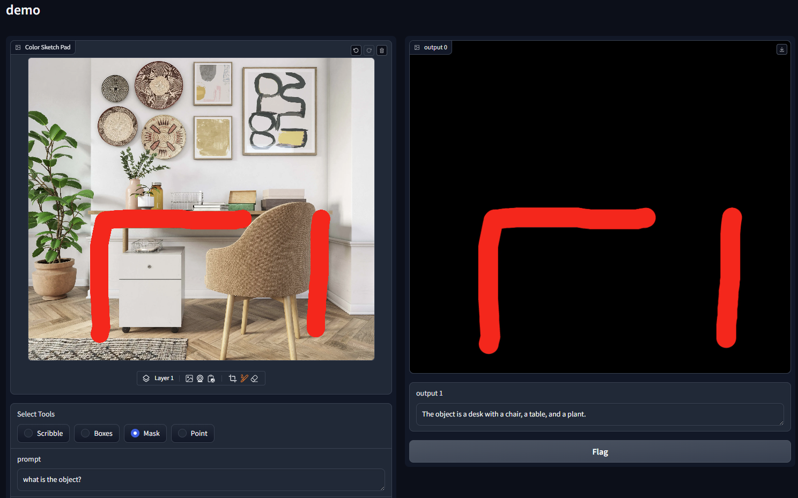

# ControlMLLM

<div align="center">
    
</div>

The repo is for the paper [ControlMLLM: Training-Free Visual Prompt Learning for Multimodal Large Language Models (NeurIPS2024)](https://arxiv.org/abs/2407.21534).

```
@article{wu2024controlmllm,
  title={Controlmllm: Training-free visual prompt learning for multimodal large language models},
  author={Wu, Mingrui and Cai, Xinyue and Ji, Jiayi and Li, Jiale and Huang, Oucheng and Luo, Gen and Fei, Hao and Jiang, Guannan and Sun, Xiaoshuai and Ji, Rongrong},
  journal={Advances in Neural Information Processing Systems},
  volume={37},
  pages={45206--45234},
  year={2024}
}
```
## Features
 - Training-free method, supports running on a single RTX 3090 24GB GPU.
 - Provides visualization tools in ```utils.py``` for interpretability.

## News
 - ```2025/5/26:``` We release the code of ControlMLLM++, an extension of ControlMLLM, which introduces a new optimization strategy for better test-time stability and convergence. The technical report is coming soon.
 - ```2024/9/26:``` ControlMLLM is accepted by NeurIPS 2024.
 - ```2024/8/21:``` We release eval pipeline on ROC and RTC task. 
 - ```2024/8/8:``` We release demo on InstructBLIP.
 - ```2024/8/2:``` We release demo on LLaVA v1.5.

## Project Structure

| Folder / File         | Description                                                                 |
|-----------------------|-----------------------------------------------------------------------------|
| `controlmllm/`         | Original ControlMLLM implementation. Includes demo scripts, ROC & RTC tasks. |
| `controlmllm++/`       | Enhanced ControlMLLM++. Supports multi-model pipelines & RD task.            |
| `datasets.md`          | Unified dataset preparation guide (ROC, RTC, RefCOCOg, ScreenSpot).         |

### Setup and Usage Instructions

- For **ControlMLLM** (ROC, RTC, demo), see [`controlmllm/RUN.md`](controlmllm/RUN.md)
- For **ControlMLLM++**, each model has its own setup and run instructions:
  - [`controlmllm++/llava/RUN.md`](controlmllm++/llava/RUN.md)
  - [`controlmllm++/qwen2_5_vl/RUN.md`](controlmllm++/qwen2_5_vl/RUN.md)

## Data preparation
Please follow the instructions at [DATASETS.md](DATASETS.md) to prepare all datasets.


## Support Models

 - [Qwen2.5-VL](https://huggingface.co/Qwen/Qwen2.5-VL-7B-Instruct)
 - [LLaVA v1.5](https://huggingface.co/llava-hf/llava-1.5-7b-hf)(version<='05ae243')
 - [InstructBLIP](https://huggingface.co/Salesforce/instructblip-vicuna-7b)
 - [LLaVA-HR](https://github.com/luogen1996/LLaVA-HR)
 - More coming soon
   
## Demo
```
python controlmllm/llava/llava_demo.py
```


Tips: Due to the image cropping during preprocessing in LLaVA1.5, referring to region at the edges of the image may become unreliable. If your referring does not work, you can also try slightly adjusting the visual prompt or text prompt, which might produce surprising results.

## Results
The results of combining with different MLLMs on ROC and RTC tasks.

<table>
  <tr>
    <th>MODELS</th>
    <th>ROC</th>
    <th>RTC</th>
  </tr>
  <tr>
    <td>LLAVA-1.5</td>
    <td>54.72</td>
    <td>57.42</td>
  </tr>
  <tr>
    <td>LLAVA-1.5 + CONTROLMLLM</td>
    <td>60.59</td>
    <td>63.06</td>
  </tr>
  <tr>
    <td>LLAVA-1.5 + CONTROLMLLM++</td>
    <td><strong>71.19</strong></td>
    <td><strong>74.66</strong></td>
  </tr>
  <tr>
    <td>LLAVA-HR</td>
    <td>53.81</td>
    <td>57.00</td>
  </tr>
  <tr>
    <td>LLAVA-HR + CONTROLMLLM</td>
    <td>58.92</td>
    <td>66.89</td>
  </tr>
  <tr>
    <td>LLAVA-HR + CONTROLMLLM++</td>
    <td><strong>69.06</strong></td>
    <td><strong>82.68</strong></td>
  </tr>
  <tr>
    <td>QWEN2.5-VL</td>
    <td>78.81</td>
    <td>81.91</td>
  </tr>
  <tr>
    <td>QWEN2.5-VL + CONTROLMLLM</td>
    <td>79.20</td>
    <td>86.43</td>
  </tr>
  <tr>
    <td>QWEN2.5-VL + CONTROLMLLM++</td>
    <td>79.20</td>
    <td><strong>88.23</strong></td>
  </tr>
</table>
Referring description performance on REFCOCOG and screenshot datasets. Metrics include BLEU-4 (B@4), METEOR (M), CIDEr (C), and SPICE (S). Our method not only equips non-referring models with effective grounding ability but also complements modern referring-capable MLLMs by enhancing their generalization and precision.

<table>
  <tr>
    <td rowspan="2"><strong>MODELS</strong></td>
    <td colspan="4"><strong>REF-COCOG (IN-DOMAIN)</strong></td>
    <td colspan="4"><strong>SCREENSHOT (OUT-OF-DOMAIN)</strong></td>
  </tr>
  <tr>
    <td>B@4</td>
    <td>M</td>
    <td>C</td>
    <td>S</td>
    <td>B@4</td>
    <td>M</td>
    <td>C</td>
    <td>S</td>
  </tr>
  <tr>
    <td>LLAVA-1.5</td>
    <td>5.02</td>
    <td>13.15</td>
    <td>55.61</td>
    <td>17.61</td>
    <td>0.32</td>
    <td>3.96</td>
    <td>9.80</td>
    <td>3.58</td>
  </tr>
  <tr>
    <td>LLAVA-1.5 + CONTROLMLLM</td>
    <td>5.53</td>
    <td>14.00</td>
    <td>59.75</td>
    <td>19.08</td>
    <td>0.45</td>
    <td>5.08</td>
    <td>19.74</td>
    <td>5.81</td>
  </tr>
  <tr>
    <td>LLAVA-1.5 + CONTROLMLLM++</td>
    <td><strong>6.24</strong></td>
    <td><strong>15.05</strong></td>
    <td><strong>67.37</strong></td>
    <td><strong>21.46</strong></td>
    <td><strong>0.57</strong></td>
    <td><strong>6.53</strong></td>
    <td><strong>40.01</strong></td>
    <td><strong>9.14</strong></td>
  </tr>
  <tr>
    <td>LLAVA-HR</td>
    <td>5.28</td>
    <td>13.45</td>
    <td>56.29</td>
    <td>18.55</td>
    <td>0.29</td>
    <td>4.27</td>
    <td>10.88</td>
    <td>4.59</td>
  </tr>
  <tr>
    <td>LLAVA-HR + CONTROLMLLM</td>
    <td>6.32</td>
    <td>15.00</td>
    <td>68.82</td>
    <td>21.55</td>
    <td>0.64</td>
    <td>6.79</td>
    <td>37.10</td>
    <td>8.54</td>
  </tr>
  <tr>
    <td>LLAVA-HR + CONTROLMLLM++</td>
    <td><strong>7.50</strong></td>
    <td><strong>16.11</strong></td>
    <td><strong>78.42</strong></td>
    <td><strong>24.02</strong></td>
    <td><strong>0.98</strong></td>
    <td><strong>9.18</strong></td>
    <td><strong>66.96</strong></td>
    <td><strong>13.83</strong></td>
  </tr>
  <tr>
    <td>QWEN2.5-VL</td>
    <td>5.22</td>
    <td>16.86</td>
    <td>56.78</td>
    <td>20.18</td>
    <td>1.09</td>
    <td>4.56</td>
    <td>34.32</td>
    <td>7.15</td>
  </tr>
  <tr>
    <td>QWEN2.5-VL + CONTROLMLLM</td>
    <td>5.33</td>
    <td><strong>16.91</strong></td>
    <td>58.20</td>
    <td>20.12</td>
    <td>4.26</td>
    <td>9.91</td>
    <td>86.35</td>
    <td>15.27</td>
  </tr>
  <tr>
    <td>QWEN2.5-VL + CONTROLMLLM++</td>
    <td><strong>5.45</strong></td>
    <td>16.53</td>
    <td><strong>59.50</strong></td>
    <td>19.95</td>
    <td><strong>9.05</strong></td>
    <td><strong>16.04</strong></td>
    <td><strong>141.36</strong></td>
    <td><strong>25.08</strong></td>
  </tr>
</table>

## Acknowledgement

[Layout-Guidance](https://github.com/silent-chen/layout-guidance), [ml-ferret](https://github.com/apple/ml-ferret), [Transformers](https://github.com/huggingface/transformers), [SeeClick](https://github.com/njucckevin/SeeClick) and [Visualizer](https://github.com/luo3300612/Visualizer).
